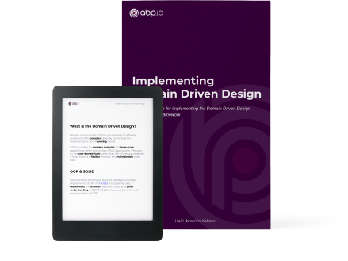

# ABP-Dokumentation

Das ABP-Framework bietet eine **Aufbauarchitektur** zur Erstellung von Unternehmenssoftwarelösungen mit **Best Practices** auf der **.NET**- und der **ASP.NET Core**-Plattform. Es bietet die grundlegende Infrastruktur, produktionsreife Startvorlagen, Module, Themen, Werkzeuge, Anleitungen und Dokumentation, um diese Architektur richtig zu implementieren und **Details** und sich wiederholende Arbeiten so weit wie möglich zu automatisieren.

# Änderungen zu Version 0.0.1

* Es gab keine Änderungen zur Version 0.0.1

## Erste Schritte

* [Quick Start](Tutorials/Todo/Overall.md) ist ein einteiliges Schnellstart-Tutorial, um eine einfache Anwendung mit dem ABP Framework zu erstellen. Beginnen Sie mit diesem Tutorial, wenn Sie schnell verstehen wollen, wie ABP funktioniert.
* [Getting Started](Getting-Started.md) ist eine Anleitung zur Erstellung und Ausführung von ABP-basierten Lösungen mit verschiedenen Optionen und Details.
* [Web Application Development Tutorial](Tutorials/Part-1.md) ist ein komplettes Tutorial zur Entwicklung einer vollwertigen Webanwendung mit allen Aspekten einer realen Lösung.

### UI Framework Optionen

ABP Framework kann mit jedem UI-Framework arbeiten, wobei die folgenden Frameworks von Haus aus unterstützt werden:

### Datenbankanbieter-Optionen

ABP Framework kann mit jedem Datenbankanbieter arbeiten, wobei die folgenden Anbieter standardmäßig unterstützt werden:

## Erkunden der Dokumentation

ABP verfügt über eine **umfassende Dokumentation**, die nicht nur das ABP Framework erklärt, sondern auch **Leitfäden** und **Beispiele** enthält, um Ihnen bei der Erstellung einer **wartbaren Lösung** zu helfen, indem allgemeine **Softwareentwicklungsprinzipien und Best Practices** vorgestellt und diskutiert werden.

### Architektur

ABP bietet eine vollständige, modulare und mehrschichtige Softwarearchitektur, die auf den Prinzipien und Mustern des [Domain-Driven-Design](Domain-Driven-Design.md) basiert. Es bietet auch die notwendige Infrastruktur, um diese Architektur zu implementieren.

* Siehe das Dokument [Modularity](Module-Development-Basics.md), um das Modulsystem zu verstehen.
* [Implementing Domain Driven Design book](https://abp.io/books/implementing-domain-driven-design?ref=doc) ist ein ultimativer Leitfaden für alle, die DDD mit dem ABP Framework verstehen und implementieren wollen.
* Das Dokument [Microservice Architecture](Microservice-Architecture.md) erklärt, wie ABP hilft, eine Microservice-Lösung zu erstellen.
* [Multi-Tenancy](Multi-Tenancy.md) Dokument führt in die Multi-Tenancy ein und untersucht die ABP Multi-Tenancy Infrastruktur.

### Infrastruktur

Das ABP-Framework bietet eine Vielzahl von Funktionen, um reale Szenarien einfacher zu realisieren, wie z.B. [Event-Bus](Event-Bus.md), [Background Job System](Background-Jobs.md), [Audit-Logging](Audit-Logging.md), [BLOB Storing](Blob-Storing.md), [Data-Seeding](Data-Seeding.md), [Data-Filtering](Data-Filtering.md).

### Übergreifende Aspekte

ABP vereinfacht (und automatisiert wo immer möglich) auch übergreifende Belange und allgemeine nicht-funktionale Anforderungen wie [Exception Handling](Exception-Handling.md), [Validation](Validation.md), [Authorization](Authorization.md), [Localization](Localization.md), [Caching](Caching.md), [Dependency Injection](Dependency-Injection.md), [Setting Management](Settings.md), etc. 

### Anwendungsmodule

Anwendungsmodule bieten vorgefertigte Anwendungsfunktionalitäten;

* [**Konto**](Modules/Account.md): Bietet eine Benutzeroberfläche für die Kontoverwaltung und ermöglicht die Anmeldung/Registrierung bei der Anwendung.
* **[Identität](Modules/Identity.md)**: Verwaltet Organisationseinheiten, Rollen, Benutzer und deren Berechtigungen, basierend auf der Microsoft Identity Bibliothek.
* [**OpenIddict**](Modules/OpenIddict.md): Integriert sich in OpenIddict.
* [**Mieterverwaltung**](Modules/Tenant-Management.md): Verwaltet Mandanten für eine [Multi-Tenant](Multi-Tenancy.md) (SaaS) Anwendung.

Siehe das Dokument [Anwendungsmodule](Modules/Index.md) für alle vorgefertigten Module.

### Startvorlagen

Die [Startup-Vorlagen](Startup-Templates/Index.md) sind vorgefertigte Visual Studio-Lösungsvorlagen. Sie können Ihre eigene Lösung auf der Grundlage dieser Vorlagen erstellen, um **sofort mit der Entwicklung zu beginnen**.

## Bücher

### Mastering ABP Framework

*Mastering ABP Framework* ist ein ultimativer Leitfaden für den Einstieg in das ABP Framework und für den Umgang damit. Es wurde von Halil İbrahim Kalkan, dem Schöpfer und Hauptentwickler des ABP Frameworks, verfasst.

**[Sie können es jetzt bei Amazon bestellen] (https://www.amazon.com/Mastering-ABP-Framework-maintainable-implementing-dp-1801079242/dp/1801079242)!**

### Kostenloses E-Book: Implementieren von Domain Driven Design

Ein **Praxisleitfaden** für die Implementierung von Domain Driven Design (DDD). Während die Implementierungsdetails **auf der ABP-Framework**-Infrastruktur basieren, können die grundlegenden Konzepte, Prinzipien und Modelle auf jede Lösung angewendet werden, auch wenn es sich nicht um eine .NET-Lösung handelt.

**[Klicken Sie hier, um Ihr kostenloses Exemplar zu erhalten](https://abp.io/books/implementing-domain-driven-design?ref=doc).**

## ABP Community

### Der Quellcode

ABP wird auf GitHub gehostet. Siehe [den Quellcode](https://github.com/abpframework).

### ABP-Gemeinschaftswebseite

Die [ABP Community](https://community.abp.io/) ist eine Website zur Veröffentlichung von Artikeln und zum Wissensaustausch über das ABP Framework. Sie können auch Inhalte für die Community erstellen!

### Blog

Folgen Sie dem [ABP Blog](https://blog.abp.io/), um sich über die neuesten Entwicklungen im ABP Framework zu informieren.

### Samples

Siehe die [Beispielprojekte](Samples/Index.md), die mit dem ABP Framework erstellt wurden.

### Möchten Sie etwas beitragen?

ABP ist ein von der Gemeinschaft getragenes Open-Source-Projekt. Sehen Sie sich den [Contribution Guide](Contribution/Index.md) an, wenn Sie an diesem Projekt mitarbeiten wollen.
